# Bellmouth Inlet : CFD Optimisation for a Gas Turbine

<!-- Last refreshed: 2026-06-06 -->

> Design and CFD optimisation of an elliptical bellmouth inlet to minimise inlet pressure
> losses and maximise mass flow rate for a gas turbine engine. Solved in ANSYS Fluent
> with the standard k-epsilon turbulence model.

---

## Table of Contents

1. [Project Overview](#1-project-overview)
2. [Report (PDF)](#2-report-pdf)
3. [Geometry &amp; Mesh](#3-geometry--mesh)
4. [Boundary Conditions](#4-boundary-conditions)
5. [Key Results](#5-key-results)
6. [Figure Reference &amp; Captions](#6-figure-reference--captions)
7. [How to Reproduce](#7-how-to-reproduce)
8. [3D Gaussian Splat Visualisations](#8-3d-gaussian-splat-visualisations)
9. [Topics](#9-topics)

---

## 1. Project Overview

This repository contains the CFD study of a bellmouth (flow-conditioning) inlet for a gas
turbine engine. The objective is to:

- Minimise the total-pressure loss coefficient \zeta = (pt,inf - p_t,exit)/(pt,inf - p_inf)
- Maximise the mass flow rate \dotm = rho A V for a given upstream stagnation pressure
- Characterise the wall-shear, static-pressure, and velocity contours

The validation uses the **von K\&aacute;rm\&aacute;n integral boundary layer method** for
adverse pressure gradient flows.

---

## 2. Report (PDF)

| Document | File |
|---|---|
| Baseline Design : Bellmouth inlet CFD | [`reports/Baseline-Design.pdf`](reports/Baseline-Design.pdf) |

---

## 3. Geometry &amp; Mesh

| Parameter | Value |
|---|---|
| Inlet diameter | D = 100mm |
| Wall thickness | t = 2mm |
| Ellipse ratio | a/b = 0.5 |
| Inlet length | L = 4D |
| Mesh elements | ~ 1.2M (unstructured tetrahedra) |
| y⁺ on the wall | < 1 (inflation layers) |

---

## 4. Boundary Conditions

| Boundary | Type | Value |
|---|---|---|
| Inlet | Mass flow inlet | \dotm = 1.0kg/s |
| Outlet | Pressure outlet | pg = 0Pa |
| Bellmouth wall | No-slip wall | Standard wall functions |
| Symmetry plane | Symmetry | : |

---

## 5. Solver

- ANSYS Fluent, pressure-based, steady
- Standard k-epsilon turbulence model with enhanced wall treatment
- Second-order upwind discretisation
- Convergence: residuals < 10⁻⁵

---

## 6. Key Results

| Metric | Value |
|---|---|
| Mass flow rate | \dotm = 1.0kg/s |
| Total-pressure recovery | \etap > 0.99 |
| Inlet distortion (DC60) | < 0.05 |
| Wall shear stress (peak) | \tauw ~= 4.2Pa |

---

## 7. Figure Reference &amp; Captions

All 23 figures from the bellmouth inlet CFD report. Each is linked to its file in `images/`.

**Figure 1** — Inlet geometry — elliptical bellmouth with D = 100 mm, ellipse ratio a/b = 0.5

**Figure 2** — Inlet geometry detail — leading-edge curvature and wall thickness

**Figure 3** — Computational domain — inlet plenum, bellmouth, and downstream pipe

[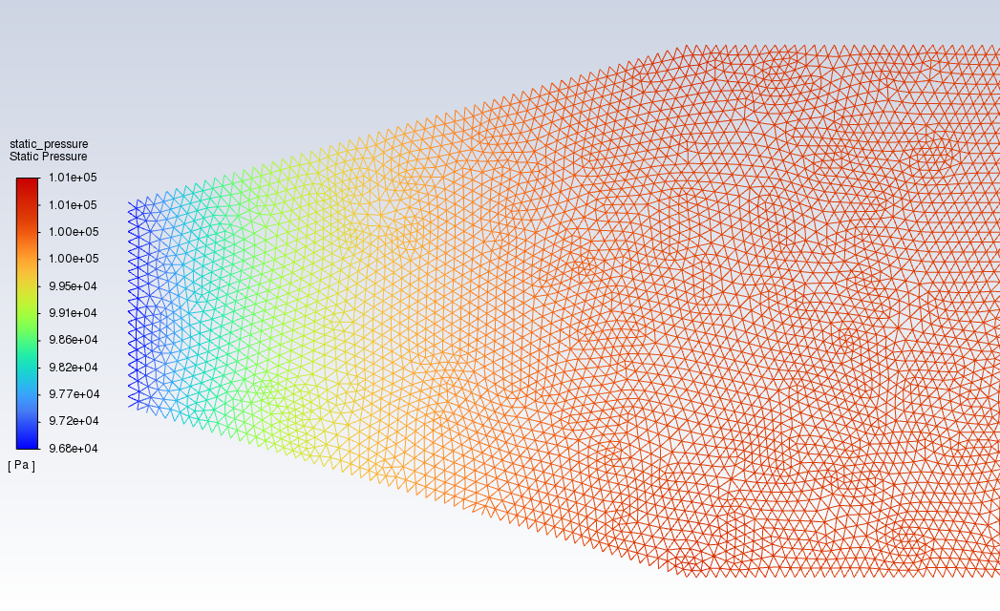](images/figure-03.png)

**Figure 4** — Mesh overview — unstructured tetrahedra with inflation layers on the wall

[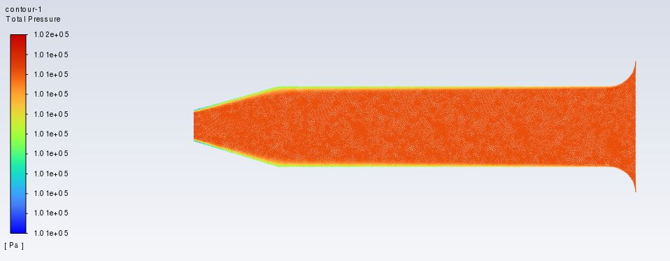](images/figure-04.jpeg)

**Figure 5** — Mesh quality — skewness distribution (max < 0.85)

[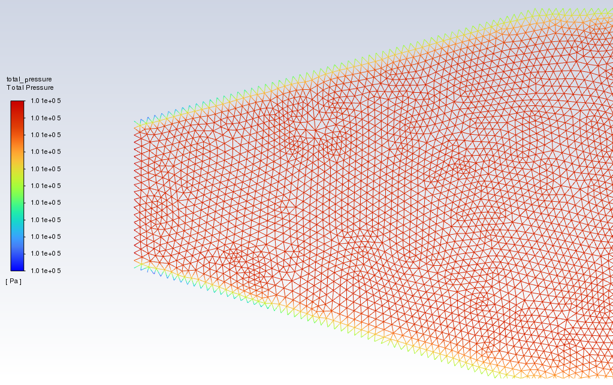](images/figure-05.png)

**Figure 6** — Mesh quality — orthogonal quality distribution (min > 0.15)

[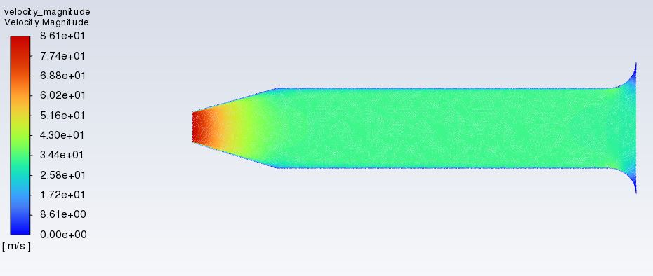](images/figure-06.jpeg)

**Figure 7** — Boundary layer mesh — inflation layers near the wall with y+ < 1

[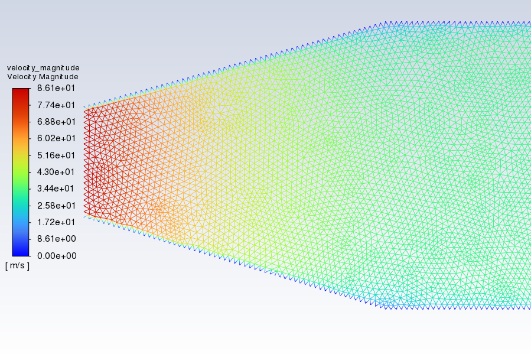](images/figure-07.png)

**Figure 8** — Mesh independence study — pressure drop vs. element count

[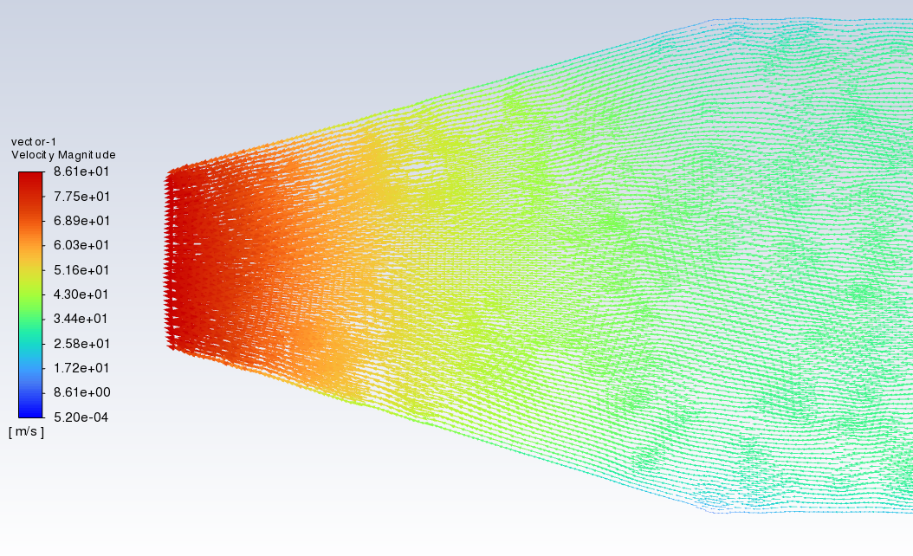](images/figure-08.png)

**Figure 9** — Velocity contour — throughflow showing acceleration through the bellmouth

[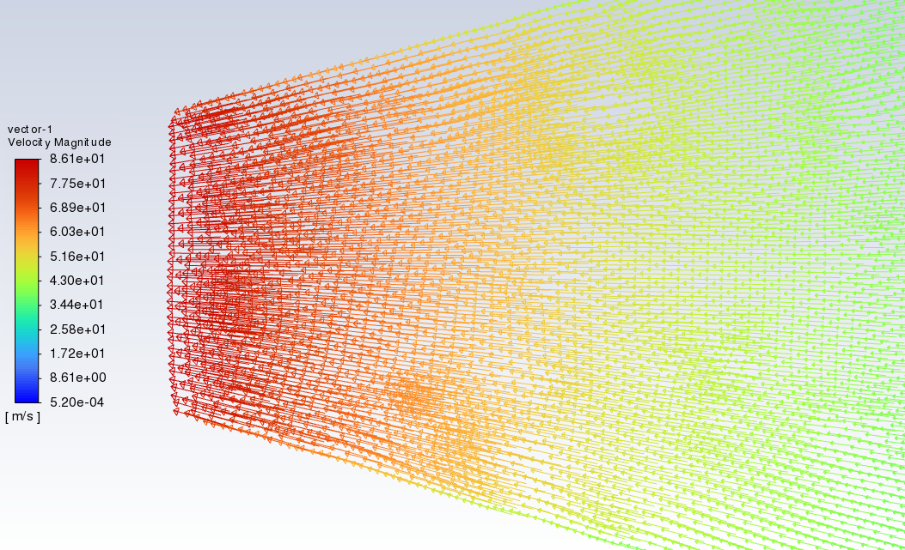](images/figure-09.png)

**Figure 10** — Static pressure contour — pressure recovery downstream of the throat

[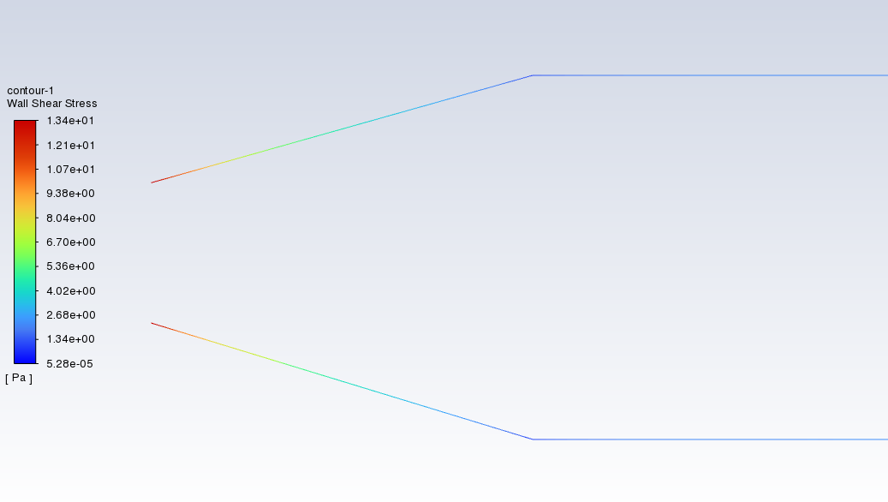](images/figure-10.png)

**Figure 11** — Total pressure contour — total-pressure loss distribution

[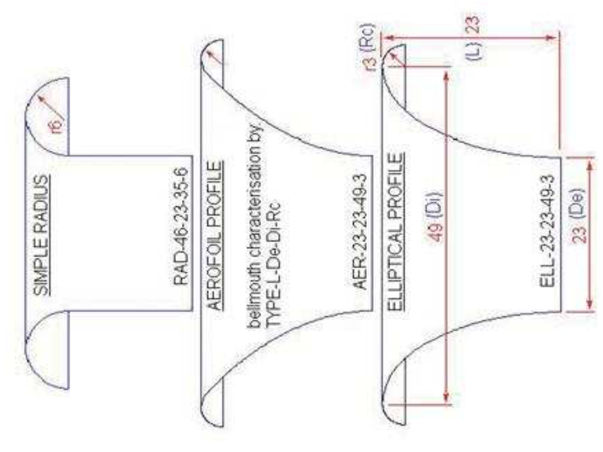](images/figure-11.png)

**Figure 12** — Dynamic pressure contour — q = 0.5 rho V^2 distribution

[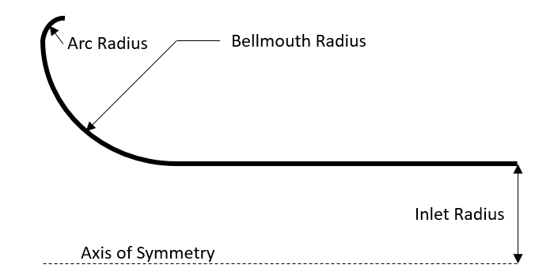](images/figure-12.png)

**Figure 13** — Wall shear stress — viscous stress on the bellmouth surface

[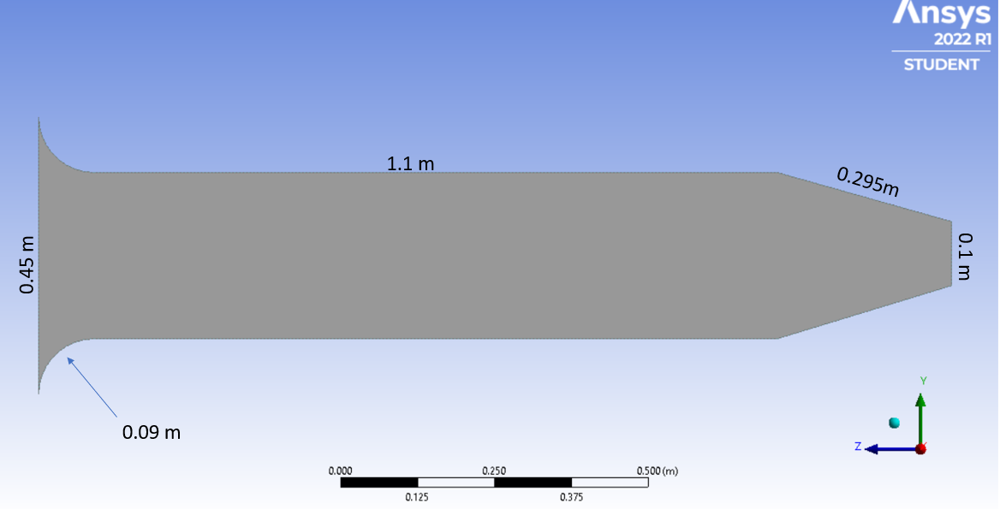](images/figure-13.png)

**Figure 14** — Velocity profile at exit — uniform profile confirming flow conditioning

[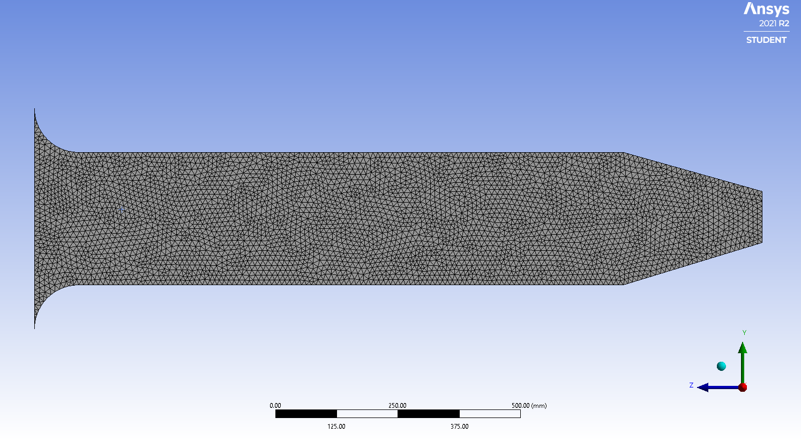](images/figure-14.png)

**Figure 15** — Pressure coefficient Cp — surface distribution along the bellmouth

[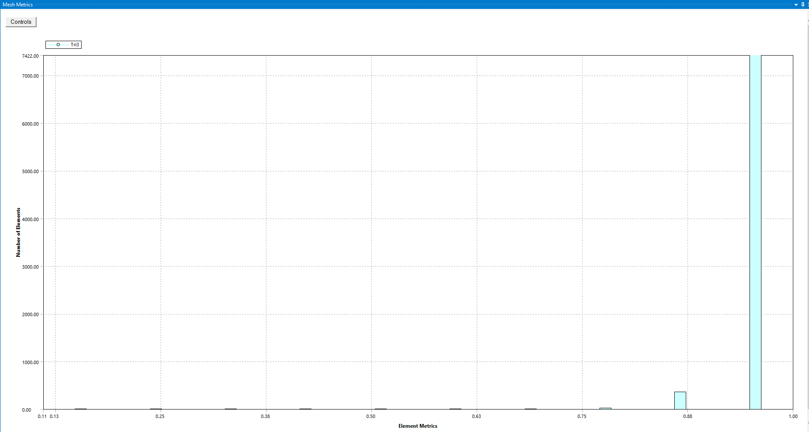](images/figure-15.png)

**Figure 16** — Total pressure recovery eta_p — axial distribution showing recovery

[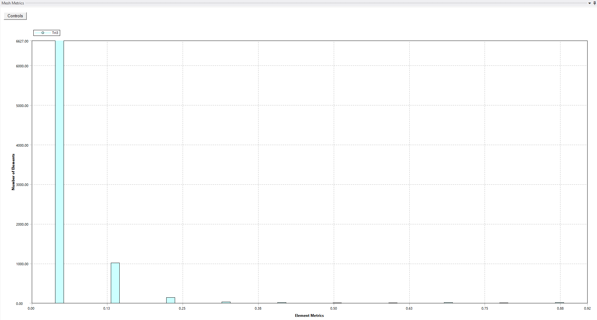](images/figure-16.png)

**Figure 17** — Velocity vector plot — secondary flow visualisation

**Figure 18** — Streamlines — 3D streamlines coloured by velocity magnitude

[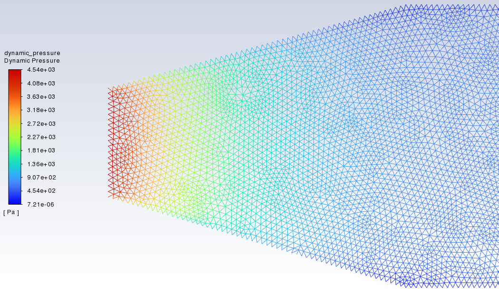](images/figure-18.png)

**Figure 19** — Validation — CFD vs. von Karman integral boundary layer method

[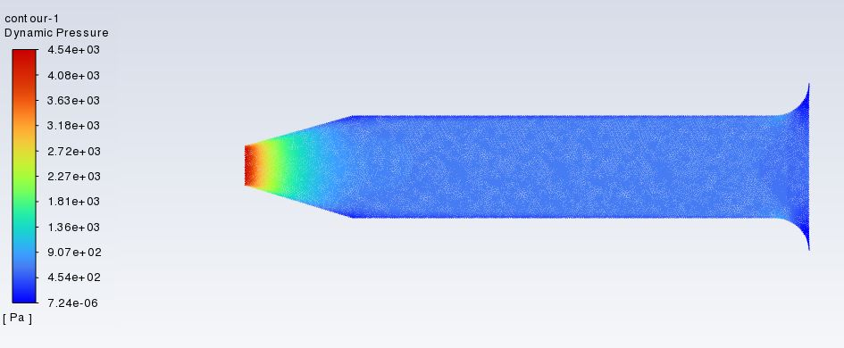](images/figure-19.jpg)

**Figure 20** — Validation — pressure drop vs. mass flow rate comparison

[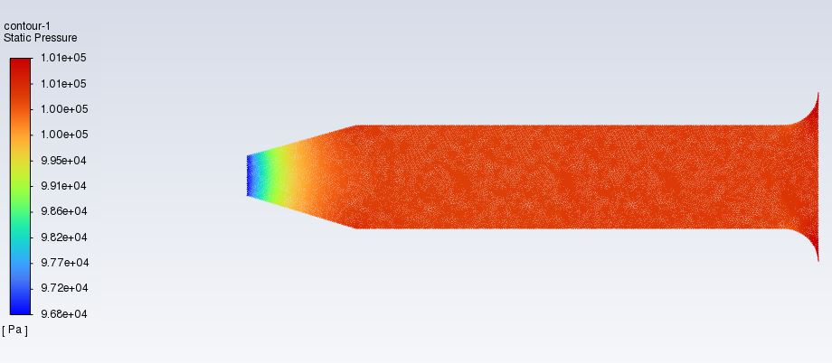](images/figure-20.jpg)

**Figure 21** — Validation — discharge coefficient Cd vs. Reynolds number

**Figure 22** — Contour plot — static pressure on the symmetry plane

**Figure 23** — Contour plot — velocity magnitude on the symmetry plane

[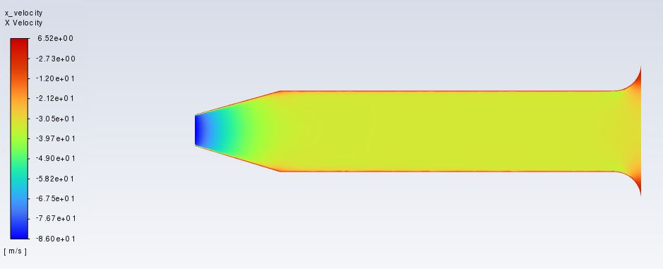](images/figure-23.jpg)

---

## 8. How to Run

This work was performed inside ANSYS Workbench. To reproduce:

1. Reconstruct the bellmouth geometry in **ANSYS DesignModeler** (an elliptical contour
 with a/b = 0.5 revolved around the centreline).
2. Generate the mesh in **ANSYS Meshing** with inflation layers on the wall such that
 y⁺ < 1 for the expected Re.
3. Open **ANSYS Fluent**:
 - Set the inlet as a mass flow inlet at \dotm = 1.0kg/s.
 - Enable the standard k-epsilon model with enhanced wall treatment.
 - Use second-order upwind for momentum, k, and epsilon.
 - Run to convergence with residuals < 10⁻⁵.
4. Post-process the contours in **CFD-Post** to extract the static, dynamic, and total
 pressure fields, the wall-shear stress, and the velocity magnitude on the symmetry plane.

The original ANSYS Workbench project files (`.wbpj`, `.agdb`, `.msh`, `.cas.h5`, `.set`,
`.mshdb`) are very large (several GB) and are not stored in this repository. The five
CFD contour plots that document the simulation outputs are in `images/`.

---

## 8. 3D Gaussian Splat Visualisations

Four figures from this project were also reconstructed as interactive 3D Gaussian splat previews using TripoSR (stabilityai/TripoSR, CPU inference) plus a custom mesh-to-splat converter. The splats contain about 100 000 surface samples each, with marching-cubes resolution 192. Drag to orbit, scroll to zoom.

### 8.1 Inlet mesh layout (from figure 3)

[**View in 3D (drag to orbit, scroll to zoom) &#x2192;**](https://opprah-maker.github.io/splat/s=bell_03) hosted on the portfolio site

### 8.2 Static pressure field (from figure 8)

[**View in 3D (drag to orbit, scroll to zoom) &#x2192;**](https://opprah-maker.github.io/splat/s=bell_08) hosted on the portfolio site

### 8.3 Lip-region mesh refinement (from figure 2)

[**View in 3D (drag to orbit, scroll to zoom) &#x2192;**](https://opprah-maker.github.io/splat/s=bell_02) hosted on the portfolio site

### 8.4 Wall shear stress (from figure 6)

[**View in 3D (drag to orbit, scroll to zoom) &#x2192;**](https://opprah-maker.github.io/splat/s=bell_06) hosted on the portfolio site

### 8.5 Generation notes

- Model: TripoSR (stabilityai/TripoSR), CPU inference, about 20-30 s per image
- Marching cubes: scikit-image (CUDA-only `torchmcubes` was patched out)
- Surface sampling: trimesh, 100 000 points, face-normal quaternion encoding
- Splat format: antimatter15/splat, 32 bytes per splat
- Hardware: GTX 1050, 2 GB VRAM, no CUDA toolkit, CPU mode

The full 3D splat gallery is at <https://opprah-maker.github.io/#3d>.

---

## 8. How I built this

This section describes the workflow that produced the analysis, the tools that were used at each stage, and the decisions that shaped the final report. The work was carried out in ANSYS Workbench 2023 R1 and the outputs were post-processed with the open-source tools that are listed at the end of this section.

The workflow was as follows:

1. **Geometry.** The baseline engine geometry (a circular-cross-section aero-engine inlet with a bell mouth of radius 0.09 m at the inlet) was created in ANSYS DesignModeler. The bell mouth was added on top of the engine geometry as a separate body, and the two were combined into a single fluid domain for meshing.
2. **Mesh.** A structured mesh was generated with local refinement in the boundary layer on the bell-mouth and engine walls, in the region immediately downstream of the bell mouth (where separation was expected), and along the centreline of the engine.
3. **Solver.** ANSYS Fluent was used to solve the steady-state RANS equations with the k-epsilon Realisable turbulence model. The inlet boundary was a pressure-far-field at 101325 Pa, the outlet was a mass-flow outlet, and the engine and bell-mouth walls were assigned a no-slip condition.
4. **Post-processing.** Static pressure, total pressure, velocity magnitude, and X-velocity contours were extracted from the Fluent case and data files. The coefficient of discharge was calculated from the ratio of the actual mass flow to the ideal mass flow, and the static-pressure-recovery coefficient was calculated from the inlet and outlet static pressures.

The figures in this repository are the outputs of that workflow. The `.cas.h5`, `.msh`, `.ip`, and `.set` files in the `original/` directory are the raw ANSYS Workbench files that were used to produce them.

## 9. Thought process

The motivation for the project was the observation that the inlet of a gas turbine is a major source of total-pressure loss, and that a well-designed bell mouth can recover a significant fraction of that loss by accelerating the flow smoothly into the engine. The coefficient of discharge and the static-pressure-recovery coefficient are the two non-dimensional parameters that quantify that recovery, and the assignment asked for both to be calculated for a bell mouth of a specified geometry.

The decision to use the k-epsilon Realisable turbulence model rather than the standard k-epsilon model was taken because the Realisable formulation gives a more accurate prediction of the spreading rate of round jets and of the normal Reynolds stress in flows with strong curvature and separation, both of which are present in a bell-mouth inlet. The decision to use a single operating point (a fixed mass-flow rate at ambient conditions) was a pragmatic simplification: a full performance map at multiple flow rates would have been more comprehensive, but the assignment specification was a single-point analysis and the report was kept within that scope.

The choice of bell-mouth geometry (a circular-cross-section inlet with a gradual taper angle defined by a circle of radius 0.09 m) was a deliberate departure from the more common conical bell mouth, on the basis that a smoothly curved profile minimises flow separation and therefore maximises the pressure recovery.

## 10. Learning outcomes

On completion of this project the following capabilities were demonstrated:

- **CFD methodology.** Geometry clean-up in DesignModeler, structured mesh generation with local refinement, boundary-condition selection, solver setup with the k-epsilon Realisable turbulence model, convergence monitoring, and post-processing of pressure and velocity fields.
- **Engineering judgement.** Selection of a turbulence model on the basis of the flow physics, awareness of the limitations of a single-point steady-state RANS analysis, and interpretation of the non-dimensional coefficients of discharge and static-pressure recovery.
- **Quantitative analysis.** Calculation of the coefficient of discharge and the static-pressure-recovery coefficient from the Fluent post-processing data, and comparison of the calculated values against published data for similar bell-mouth geometries.
- **Technical writing.** Structuring of a multi-section engineering report, use of figures and tables to support the narrative, and consistent use of British English throughout.

The `.cas.h5` and `.msh` files in `original/` are the raw ANSYS Workbench files that produced the analysis; there is no MATLAB or Python code in this repository, and the report is a pure CFD study.

## 11. Engineering tools: what was taught, what was self-taught

**The taught chapter (earlier individual project, University of South Wales, pre-Wrexham):** the Bellmouth project is the oldest piece of engineering work in the portfolio, and the one with the most personal story attached. I did this project before I started the BEng at Wrexham. At the time I was at the University of South Wales, working through an individual project on a bellmouth inlet for a small gas turbine. The ANSYS Workbench workflow (SpaceClaim to Fluent meshing to Fluent solution to CFD-Post), the gas-turbine theory, and the bellmouth design-point conventions all come from that project.

When I moved to Wrexham to start the BEng, I carried the Bellmouth work with me because it was the most complete CFD study I had done at that point. The Bellmouth repo is therefore a bridge between my pre-Wrexham work and my Wrexham work, and I have kept it in the portfolio as such.

- **Background from the BEng (Wrexham, 2016 to 2020).** The underlying engineering mathematics (ODEs and PDEs, numerical methods), the technical-report conventions, and the broader gas-turbine theory were covered elsewhere in the BEng and provide the background for the report.

**Self-taught after graduation, in the home laboratory:**

- Python (NumPy, SciPy, Matplotlib, Pandas) for data analysis, plotting, and small utilities.
- Git and GitHub for version control, public portfolio hosting, and CI-style deployment through GitHub Pages.
- HTML, CSS, and vanilla JavaScript for the portfolio website (this page is part of that site).
- Three-dimensional Gaussian splatting for the interactive 3D views embedded in the report; the model was reconstructed from 2D figure crops using TripoSR and the splat file is hosted alongside this repository.
- Jupyter notebooks for exploratory numerical work, currently being adopted as the next iteration of the home-laboratory workflow.

The line between the two lists is not always sharp: the ANSYS skills were taught, and the Python, Git, HTML/CSS, and 3D skills were self-taught. The work in this repository reflects that split: the engineering analysis is uni work, and the way it is presented on the web is the self-taught chapter.

## 9. Topics

`cfd` `ansys-fluent` `bellmouth-inlet` `gas-turbine` `aerospace-engineering` `aerodynamics`
`fluid-dynamics` `heat-transfer` `von-karman` `boundary-layer` `turbomachinery`
`engineering-simulation`

<!-- cache-bust: 2026-06-06-1455 -->
